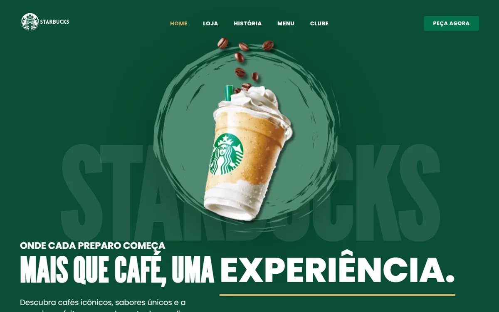

# Landing Page Starbucks

Landing page responsiva com o tema Starbucks, desenvolvida com metodologia mobile-first e animações customizadas em CSS e JavaScript, sem frameworks de layout.


[](https://otavio-2507.github.io/Starbucks/)

[](https://otavio-2507.github.io/Starbucks/)

## Visão geral

O projeto reproduz uma página promocional no estilo da marca Starbucks, construída primeiro para telas pequenas e progressivamente adaptada para desktop. A organização do CSS separa variáveis de design (cores, tipografia), navegação e estilos gerais em arquivos próprios, e as animações de entrada e interação foram escritas manualmente, sem bibliotecas.

## Funcionalidades

- Layout mobile-first com adaptação progressiva para telas maiores
- Navbar responsiva com menu para dispositivos móveis
- Vitrine de produtos com imagens da linha da marca
- Seção institucional com fundo e composição próprios
- Animações suaves de entrada e interação em CSS e JavaScript
- Design tokens centralizados em `variables.css`

## Tecnologias

| Tecnologia | Aplicação no projeto |
| --- | --- |
| HTML5 | Estrutura semântica da página |
| CSS3 | Variáveis de design, media queries e animações customizadas |
| JavaScript | Interações da navbar e animações |
| Google Fonts | Tipografia da página |

## Como executar

```bash
git clone https://github.com/OTAVIO-2507/Starbucks.git
cd Starbucks
```

Abra o arquivo `index.html` no navegador. As dependências são carregadas via CDN.

## Estrutura do projeto

```
Starbucks/
├── index.html              Página única
├── src/
│   ├── css/
│   │   ├── variables.css   Tokens de design (cores, tipografia)
│   │   ├── navbar.css      Estilos da navegação
│   │   └── styles.css      Estilos gerais e seções
│   ├── images/             Produtos, logos e fundos
│   └── javascript/         Interações
└── docs/
    └── preview.webp        Imagem de prévia do README
```

## Referências

Projeto desenvolvido como estudo a partir do tutorial de Larissa Kich: [Landing Page com HTML, CSS e JavaScript — Mobile First (YouTube)](https://www.youtube.com/watch?v=ik-njdH5Q5c).

## Autor

**Otávio Oliveira** — Desenvolvedor Full Stack

[GitHub](https://github.com/OTAVIO-2507) · [Portfólio](https://otavio-2507.github.io/Portifolio-v2/) · [E-mail](mailto:56otavio@gmail.com)
