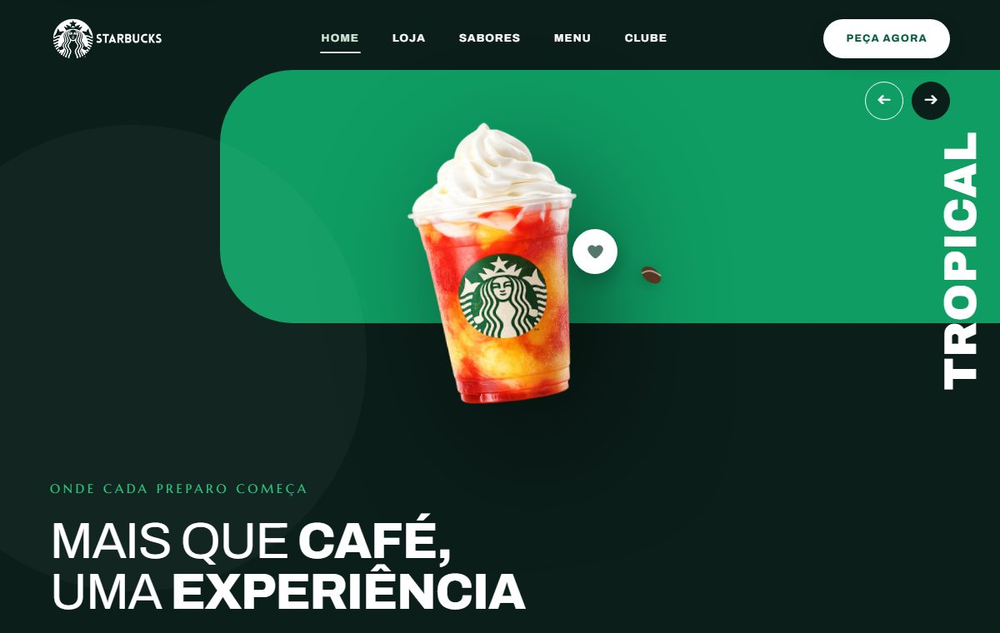

<div align="center">

# Landing Page Starbucks

Landing page responsiva com o tema Starbucks, desenvolvida com metodologia mobile-first e animações customizadas em CSS e JavaScript, sem frameworks de layout.




**[Ver Projeto](https://otavio-2507.github.io/Starbucks/)**

</div>

## Visão geral

O projeto reproduz uma página promocional no estilo da marca Starbucks, construída primeiro para telas pequenas e progressivamente adaptada para desktop. A organização do CSS separa variáveis de design (cores, tipografia), navegação e estilos gerais em arquivos próprios, e as animações de entrada e interação foram escritas manualmente, sem bibliotecas.

## Funcionalidades

- Layout mobile-first com adaptação progressiva para telas maiores
- Navbar responsiva com menu para dispositivos móveis
- Vitrine de produtos com imagens da linha da marca
- Seção institucional com fundo e composição próprios
- Animações suaves de entrada e interação em CSS e JavaScript
- Design tokens centralizados em `variables.css`

## Decisões de projeto

Algumas escolhas que não são óbvias pelo código:

**Um só ouvinte de rolagem, agendado por quadro.** Estado do cabeçalho e link ativo do menu saem do mesmo `onScroll`, protegido por uma trava (`ticking`) que só libera dentro de `requestAnimationFrame` e registrado com `{ passive: true }`. Dois ouvintes separados fariam o dobro de leituras de layout a cada pixel rolado, e sem `passive` o navegador precisa esperar o handler antes de rolar.

**A seção ativa é a última que cruzou 35% da tela.** Não é a que está no topo nem a mais visível: é uma linha imaginária a 35% da altura da viewport, e vale a última seção cujo topo já passou dela. A regra evita o menu piscando entre dois itens quando duas seções dividem a tela.

**A revelação acontece uma vez e o observador se desliga.** Cada elemento com `data-reveal` recebe a classe e sai do `IntersectionObserver` na mesma chamada — quem já apareceu não volta a ser observado, e nada é reescondido ao rolar de volta.

**O conteúdo não depende de JavaScript para existir.** Um bloco `<noscript>` força `[data-reveal] { opacity: 1 }`, e navegadores sem `IntersectionObserver` caem em `revealAll()`. Sem essas duas saídas, a animação de entrada viraria uma página em branco no primeiro cenário em que o script não rodasse.

## Tecnologias

| Tecnologia | Aplicação no projeto |
| --- | --- |
| HTML5 | Estrutura semântica da página |
| CSS3 | Variáveis de design, media queries e animações customizadas |
| JavaScript | Interações da navbar e animações |
| Google Fonts | Tipografia da página |

## Como executar

```bash
git clone https://github.com/OTAVIO-2507/Starbucks.git
cd Starbucks
```

Abra o arquivo `index.html` no navegador. As dependências são carregadas via CDN.

## Estrutura do projeto

```
Starbucks/
├── index.html              Página única
└── src/
    ├── css/
    │   ├── variables.css   Tokens de design (cores, tipografia)
    │   ├── navbar.css      Estilos da navegação
    │   └── styles.css      Estilos gerais e seções
    ├── images/             Produtos, logos e fundos
    └── javascript/         Interações
```

## Referências

Projeto desenvolvido como estudo a partir do tutorial de Larissa Kich: [Landing Page com HTML, CSS e JavaScript — Mobile First (YouTube)](https://www.youtube.com/watch?v=ik-njdH5Q5c).

